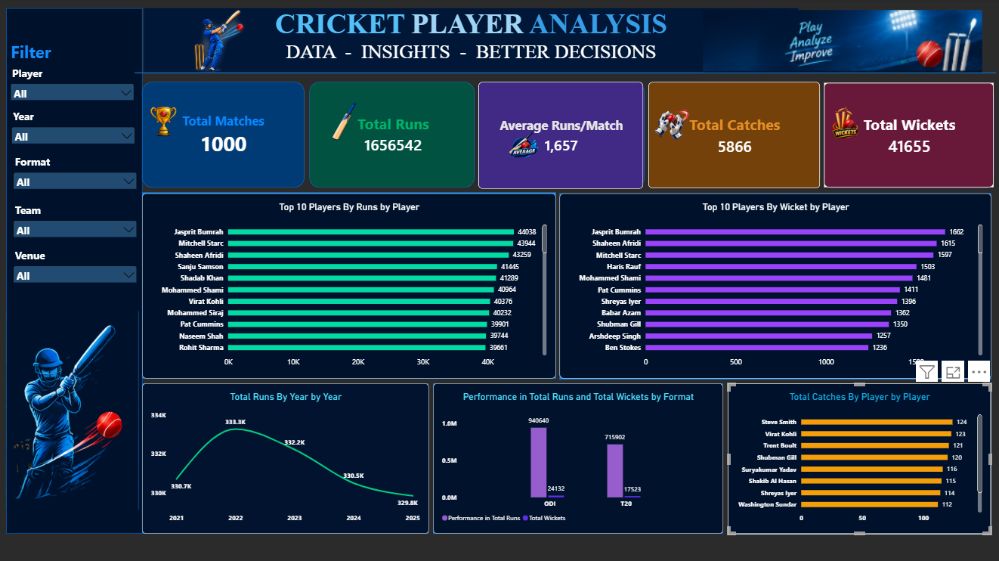

🏏 Cricket Performance Analysis Dashboard

An interactive Cricket Performance Analysis Dashboard built using Microsoft Power BI to analyze player performance, batting statistics, bowling performance, and yearly/format-wise trends.

The dashboard allows users to explore cricket data using interactive filters and visually understand player performance through KPIs and charts.

📊 Dashboard Preview

🎯 Project Objective

The main objective of this project is to analyze cricket performance data and create an interactive dashboard that provides meaningful insights into:

Player batting performance
Player bowling performance
Runs and wickets
Catches
Year-wise performance
Format-wise performance
Top-performing players
🛠️ Tools & Technologies
Power BI
Microsoft Excel
Power Query
DAX
Data Cleaning & Transformation
Data Visualization
📌 Key Performance Indicators

The dashboard includes the following KPIs:

🏏 Total Matches
🏃 Total Runs
📊 Average Runs per Match
🧤 Total Catches
🎯 Total Wickets
📈 Dashboard Visualizations

The dashboard contains:

🏆 Top 10 Players by Runs

Displays the top 10 players based on total runs scored.

🎯 Top 10 Players by Wickets

Shows the top 10 players with the highest number of wickets.

🧤 Top 10 Players by Catches

Highlights players with the highest number of catches.

📅 Total Runs by Year

Shows the trend of total runs across different years.

🏏 Performance by Format

Compares player performance across different cricket formats using runs and wickets.

🎛️ Interactive Filters

Users can interact with the dashboard using slicers for:

Player
Year
Format
Team
Venue

These filters allow users to explore specific parts of the cricket dataset dynamically.

🔄 Data Preparation

The dataset was cleaned and transformed before creating the dashboard.

The data preparation process included:

Removing duplicate records
Handling missing values
Correcting data types
Cleaning player and team names
Checking numerical values
Preparing data for Power BI
Creating calculated measures using DAX
🧮 DAX & Measures

DAX measures were created to calculate important KPIs and performance metrics such as:

Total Runs
Total Wickets
Total Catches
Total Matches
Average Runs per Match

These measures were then used across the dashboard visuals.

💡 Key Insights

The dashboard helps identify:

Top run-scoring players
Leading wicket-taking players
Players with the highest catches
Year-wise changes in batting performance
Differences in performance across cricket formats
Overall player performance trends

📁 Project Structure

Cricket-Performance-Analysis-PowerBI
│
├── CRICKET_DATA_ANALYSIS.xlsx
├── CRICKET DATA ANALYSIS.pbix
├── Cricket_Dashboard.png
├── README.md
└── LICENSE

🚀 Project Outcome

This project demonstrates practical skills in:

Data cleaning
Data transformation
Power Query
DAX
KPI creation
Data visualization
Dashboard design
Interactive reporting
Business-style data analysis
👨‍💻 Author

Ajay Kumar

Aspiring Data Analyst | Power BI | SQL | Excel | Data Analytics

⭐ If you find this project useful, feel free to explore the repository and connect with me.
